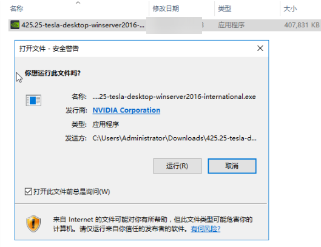
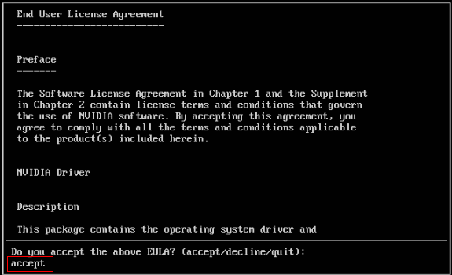

# GPU加速型实例安装NVIDIA GPU驱动及CUDA工具包<a name="ZH-CN_TOPIC_0149470468"></a>

## 操作场景<a name="section11831857193910"></a>

使用GPU加速型弹性云服务器时，需确保云服务器已安装GPU驱动和CUDA工具包，否则无法实现计算加速功能。

## 安装须知<a name="section14189185733910"></a>

-   云服务器已绑定弹性公网IP。
-   云服务器未安装GPU驱动以及CUDA工具包。

> **说明：**   
>-   从NVIDIA官网下载CUDA工具包进行安装，通常会同时自动安装一个和CUDA版本匹配的NVIDIA GPU驱动，免去用户单独安装NVIDIA GPU驱动的步骤。  
>-   但是如果您的云服务器用作生产用途，请务必先单独从NVIDIA官网下载并安装匹配的NVIDIA GPU驱动，然后在再安装CUDA工具包。  
>-   如果云服务器已经安装了NVIDIA GPU驱动，请检查当前驱动版本是否可用。如需安装新版本的驱动请卸载旧版本的NVIDIA GPU驱动，避免因驱动程序冲突导致安装失败。  

安装指引：

-   [CUDA工具包下载地址](#section10203125783920)
-   安装NVIDIA驱动
    -   [Linux操作系统云服务器安装NVIDIA GPU驱动](#section1728514576397)
    -   [Windows操作系统云服务器安装NVIDIA GPU驱动](#section244363219171)

-   安装CUDA驱动
    -   [Linux操作系统安装CUDA工具包](#section1034245773916)
    -   [Windows操作系统安装CUDA工具包](#section0337133719497)


## CUDA工具包下载地址<a name="section10203125783920"></a>

**表 1**  P2v实例CUDA工具包下载地址

<a name="table1568017042711"></a>
<table><thead align="left"><tr id="row156808014275"><th class="cellrowborder" valign="top" width="12.48%" id="mcps1.2.6.1.1"><p id="p1268060192714"><a name="p1268060192714"></a><a name="p1268060192714"></a><strong id="b126813072715"><a name="b126813072715"></a><a name="b126813072715"></a>实例</strong></p>
<p id="p1768110192710"><a name="p1768110192710"></a><a name="p1768110192710"></a><strong id="b5681140172713"><a name="b5681140172713"></a><a name="b5681140172713"></a>类型</strong></p>
</th>
<th class="cellrowborder" valign="top" width="16.950000000000003%" id="mcps1.2.6.1.2"><p id="p10681208276"><a name="p10681208276"></a><a name="p10681208276"></a><strong id="b56814012719"><a name="b56814012719"></a><a name="b56814012719"></a>操作系统</strong></p>
</th>
<th class="cellrowborder" valign="top" width="19.160000000000004%" id="mcps1.2.6.1.3"><p id="p2068130112711"><a name="p2068130112711"></a><a name="p2068130112711"></a><strong id="b14681507272"><a name="b14681507272"></a><a name="b14681507272"></a>CUDA版本</strong></p>
</th>
<th class="cellrowborder" valign="top" width="28.290000000000003%" id="mcps1.2.6.1.4"><p id="p5681301272"><a name="p5681301272"></a><a name="p5681301272"></a><strong id="b16681170112716"><a name="b16681170112716"></a><a name="b16681170112716"></a>下载路径</strong></p>
</th>
<th class="cellrowborder" valign="top" width="23.12%" id="mcps1.2.6.1.5"><p id="p668115013273"><a name="p668115013273"></a><a name="p668115013273"></a><strong id="b20681160142710"><a name="b20681160142710"></a><a name="b20681160142710"></a>CPU架构</strong></p>
</th>
</tr>
</thead>
<tbody><tr id="row9681305277"><td class="cellrowborder" valign="top" width="12.48%" headers="mcps1.2.6.1.1 "><p id="p193381141288"><a name="p193381141288"></a><a name="p193381141288"></a>P2v</p>
<p id="p11338111420282"><a name="p11338111420282"></a><a name="p11338111420282"></a>(V100)</p>
</td>
<td class="cellrowborder" valign="top" width="16.950000000000003%" headers="mcps1.2.6.1.2 "><p id="p524971716290"><a name="p524971716290"></a><a name="p524971716290"></a>CentOS 7.4 64bit</p>
</td>
<td class="cellrowborder" valign="top" width="19.160000000000004%" headers="mcps1.2.6.1.3 "><p id="p1468112011275"><a name="p1468112011275"></a><a name="p1468112011275"></a>9.2/10.1</p>
<p id="p14912682331"><a name="p14912682331"></a><a name="p14912682331"></a>内核版本不高于3.10.0-957.5.1.e17.x86_64时可以安装9.2版本的CUDA工具包。</p>
</td>
<td class="cellrowborder" rowspan="5" valign="top" width="28.290000000000003%" headers="mcps1.2.6.1.4 "><p id="p16732131003213"><a name="p16732131003213"></a><a name="p16732131003213"></a>9.2版本：<a href="https://developer.nvidia.com/cuda-92-download-archive" target="_blank" rel="noopener noreferrer">https://developer.nvidia.com/cuda-92-download-archive</a></p>
<p id="p8732191063214"><a name="p8732191063214"></a><a name="p8732191063214"></a></p>
<p id="p473211063217"><a name="p473211063217"></a><a name="p473211063217"></a>10.1版本：</p>
<p id="p117321110123212"><a name="p117321110123212"></a><a name="p117321110123212"></a><a href="https://developer.nvidia.com/cuda-10.1-download-archive-base" target="_blank" rel="noopener noreferrer">https://developer.nvidia.com/cuda-10.1-download-archive-base</a></p>
</td>
<td class="cellrowborder" valign="top" width="23.12%" headers="mcps1.2.6.1.5 "><p id="p2681200142714"><a name="p2681200142714"></a><a name="p2681200142714"></a>x86_64</p>
</td>
</tr>
<tr id="row57457541274"><td class="cellrowborder" valign="top" headers="mcps1.2.6.1.1 "><p id="p10222812102813"><a name="p10222812102813"></a><a name="p10222812102813"></a>P2v</p>
<p id="p42221112152817"><a name="p42221112152817"></a><a name="p42221112152817"></a>(V100)</p>
</td>
<td class="cellrowborder" valign="top" headers="mcps1.2.6.1.2 "><p id="p8249101718293"><a name="p8249101718293"></a><a name="p8249101718293"></a>EulerOS 2.2 64bit</p>
</td>
<td class="cellrowborder" valign="top" headers="mcps1.2.6.1.3 "><p id="p1746205419275"><a name="p1746205419275"></a><a name="p1746205419275"></a>9.2</p>
</td>
<td class="cellrowborder" valign="top" headers="mcps1.2.6.1.4 "><p id="p174612544273"><a name="p174612544273"></a><a name="p174612544273"></a>x86_64</p>
</td>
</tr>
<tr id="row1781505172819"><td class="cellrowborder" valign="top" headers="mcps1.2.6.1.1 "><p id="p039911562810"><a name="p039911562810"></a><a name="p039911562810"></a>P2v</p>
<p id="p18399815202811"><a name="p18399815202811"></a><a name="p18399815202811"></a>(V100)</p>
</td>
<td class="cellrowborder" valign="top" headers="mcps1.2.6.1.2 "><p id="p0250181719294"><a name="p0250181719294"></a><a name="p0250181719294"></a>Ubuntu 16.04 64bit</p>
<p id="p19250917112920"><a name="p19250917112920"></a><a name="p19250917112920"></a></p>
</td>
<td class="cellrowborder" valign="top" headers="mcps1.2.6.1.3 "><p id="p128153512286"><a name="p128153512286"></a><a name="p128153512286"></a>9.2/10.1</p>
<p id="p841162753314"><a name="p841162753314"></a><a name="p841162753314"></a>内核版本不高于4.4.0-141-generic时可以安装9.2版本的CUDA工具包。</p>
</td>
<td class="cellrowborder" valign="top" headers="mcps1.2.6.1.4 "><p id="p1381555132812"><a name="p1381555132812"></a><a name="p1381555132812"></a>x86_64</p>
</td>
</tr>
<tr id="row19371337288"><td class="cellrowborder" valign="top" headers="mcps1.2.6.1.1 "><p id="p11475716112817"><a name="p11475716112817"></a><a name="p11475716112817"></a>P2v</p>
<p id="p0475181615287"><a name="p0475181615287"></a><a name="p0475181615287"></a>(V100)</p>
</td>
<td class="cellrowborder" valign="top" headers="mcps1.2.6.1.2 "><p id="p2250141712298"><a name="p2250141712298"></a><a name="p2250141712298"></a>Windows Server 2016 Standard 64bit</p>
</td>
<td class="cellrowborder" valign="top" headers="mcps1.2.6.1.3 "><p id="p23813332812"><a name="p23813332812"></a><a name="p23813332812"></a>9.2/10.1</p>
</td>
<td class="cellrowborder" valign="top" headers="mcps1.2.6.1.4 "><p id="p193816311284"><a name="p193816311284"></a><a name="p193816311284"></a>x86_64</p>
</td>
</tr>
<tr id="row33813162818"><td class="cellrowborder" valign="top" headers="mcps1.2.6.1.1 "><p id="p03881317172812"><a name="p03881317172812"></a><a name="p03881317172812"></a>P2v</p>
<p id="p73881817102817"><a name="p73881817102817"></a><a name="p73881817102817"></a>(V100)</p>
</td>
<td class="cellrowborder" valign="top" headers="mcps1.2.6.1.2 "><p id="p182501177297"><a name="p182501177297"></a><a name="p182501177297"></a>Windows Server 2012 R2 Standard 64bit</p>
</td>
<td class="cellrowborder" valign="top" headers="mcps1.2.6.1.3 "><p id="p163843152816"><a name="p163843152816"></a><a name="p163843152816"></a>9.2/10.1</p>
</td>
<td class="cellrowborder" valign="top" headers="mcps1.2.6.1.4 "><p id="p15386317283"><a name="p15386317283"></a><a name="p15386317283"></a>x86_64</p>
</td>
</tr>
</tbody>
</table>

**表 2**  P1实例CUDA工具包下载地址

<a name="table10558744163515"></a>
<table><thead align="left"><tr id="row11558444123510"><th class="cellrowborder" valign="top" width="12.530000000000003%" id="mcps1.2.6.1.1"><p id="p12558194412351"><a name="p12558194412351"></a><a name="p12558194412351"></a><strong id="b355824463511"><a name="b355824463511"></a><a name="b355824463511"></a>实例</strong></p>
<p id="p3558544153516"><a name="p3558544153516"></a><a name="p3558544153516"></a><strong id="b1055804433520"><a name="b1055804433520"></a><a name="b1055804433520"></a>类型</strong></p>
</th>
<th class="cellrowborder" valign="top" width="16.900000000000006%" id="mcps1.2.6.1.2"><p id="p13559124453511"><a name="p13559124453511"></a><a name="p13559124453511"></a><strong id="b65597444358"><a name="b65597444358"></a><a name="b65597444358"></a>操作系统</strong></p>
</th>
<th class="cellrowborder" valign="top" width="15.230000000000002%" id="mcps1.2.6.1.3"><p id="p35591044143520"><a name="p35591044143520"></a><a name="p35591044143520"></a><strong id="b19559134453515"><a name="b19559134453515"></a><a name="b19559134453515"></a>CUDA版本</strong></p>
</th>
<th class="cellrowborder" valign="top" width="32.220000000000006%" id="mcps1.2.6.1.4"><p id="p14559244193519"><a name="p14559244193519"></a><a name="p14559244193519"></a><strong id="b1555915448353"><a name="b1555915448353"></a><a name="b1555915448353"></a>下载路径</strong></p>
</th>
<th class="cellrowborder" valign="top" width="23.12%" id="mcps1.2.6.1.5"><p id="p9559114493518"><a name="p9559114493518"></a><a name="p9559114493518"></a><strong id="b85591644183514"><a name="b85591644183514"></a><a name="b85591644183514"></a>CPU架构</strong></p>
</th>
</tr>
</thead>
<tbody><tr id="row17559844123515"><td class="cellrowborder" valign="top" width="12.530000000000003%" headers="mcps1.2.6.1.1 "><p id="p167751451103510"><a name="p167751451103510"></a><a name="p167751451103510"></a>P1</p>
<p id="p1677525103511"><a name="p1677525103511"></a><a name="p1677525103511"></a>(P100)</p>
</td>
<td class="cellrowborder" valign="top" width="16.900000000000006%" headers="mcps1.2.6.1.2 "><p id="p14910138153610"><a name="p14910138153610"></a><a name="p14910138153610"></a>CentOS 7.3 64bit</p>
</td>
<td class="cellrowborder" valign="top" width="15.230000000000002%" headers="mcps1.2.6.1.3 "><p id="p115591644203519"><a name="p115591644203519"></a><a name="p115591644203519"></a>9</p>
</td>
<td class="cellrowborder" rowspan="3" valign="top" width="32.220000000000006%" headers="mcps1.2.6.1.4 "><p id="p173767017378"><a name="p173767017378"></a><a name="p173767017378"></a><a href="https://developer.nvidia.com/cuda-90-download-archive" target="_blank" rel="noopener noreferrer">https://developer.nvidia.com/cuda-90-download-archive</a></p>
</td>
<td class="cellrowborder" valign="top" width="23.12%" headers="mcps1.2.6.1.5 "><p id="p1955934410359"><a name="p1955934410359"></a><a name="p1955934410359"></a>x86_64</p>
</td>
</tr>
<tr id="row19656202314361"><td class="cellrowborder" valign="top" headers="mcps1.2.6.1.1 "><p id="p2075731173712"><a name="p2075731173712"></a><a name="p2075731173712"></a>P1</p>
<p id="p137578116371"><a name="p137578116371"></a><a name="p137578116371"></a>(P100)</p>
</td>
<td class="cellrowborder" valign="top" headers="mcps1.2.6.1.2 "><p id="p1591013893618"><a name="p1591013893618"></a><a name="p1591013893618"></a>Ubuntu 16.04 64bit</p>
</td>
<td class="cellrowborder" valign="top" headers="mcps1.2.6.1.3 "><p id="p17656523163612"><a name="p17656523163612"></a><a name="p17656523163612"></a>9</p>
</td>
<td class="cellrowborder" valign="top" headers="mcps1.2.6.1.4 "><p id="p14656162373614"><a name="p14656162373614"></a><a name="p14656162373614"></a>x86_64</p>
</td>
</tr>
<tr id="row17373122123614"><td class="cellrowborder" valign="top" headers="mcps1.2.6.1.1 "><p id="p19797121210375"><a name="p19797121210375"></a><a name="p19797121210375"></a>P1</p>
<p id="p37971412113710"><a name="p37971412113710"></a><a name="p37971412113710"></a>(P100)</p>
</td>
<td class="cellrowborder" valign="top" headers="mcps1.2.6.1.2 "><p id="p15910173812363"><a name="p15910173812363"></a><a name="p15910173812363"></a>Windows Server 2012 R2 Standard 64bit</p>
</td>
<td class="cellrowborder" valign="top" headers="mcps1.2.6.1.3 "><p id="p133741121143610"><a name="p133741121143610"></a><a name="p133741121143610"></a>9</p>
</td>
<td class="cellrowborder" valign="top" headers="mcps1.2.6.1.4 "><p id="p123741021103611"><a name="p123741021103611"></a><a name="p123741021103611"></a>x86_64</p>
</td>
</tr>
</tbody>
</table>

**表 3**  Pi1实例CUDA工具包下载地址

<a name="table6355115314383"></a>
<table><thead align="left"><tr id="row9355125383813"><th class="cellrowborder" valign="top" width="12.48%" id="mcps1.2.6.1.1"><p id="p1535555363814"><a name="p1535555363814"></a><a name="p1535555363814"></a><strong id="b153551353133819"><a name="b153551353133819"></a><a name="b153551353133819"></a>实例</strong></p>
<p id="p835517539383"><a name="p835517539383"></a><a name="p835517539383"></a><strong id="b173551953163816"><a name="b173551953163816"></a><a name="b173551953163816"></a>类型</strong></p>
</th>
<th class="cellrowborder" valign="top" width="17.040000000000003%" id="mcps1.2.6.1.2"><p id="p16355115373819"><a name="p16355115373819"></a><a name="p16355115373819"></a><strong id="b6355175314388"><a name="b6355175314388"></a><a name="b6355175314388"></a>操作系统</strong></p>
</th>
<th class="cellrowborder" valign="top" width="15.140000000000004%" id="mcps1.2.6.1.3"><p id="p203561053133817"><a name="p203561053133817"></a><a name="p203561053133817"></a><strong id="b18356175314388"><a name="b18356175314388"></a><a name="b18356175314388"></a>CUDA版本</strong></p>
</th>
<th class="cellrowborder" valign="top" width="32.220000000000006%" id="mcps1.2.6.1.4"><p id="p33565536387"><a name="p33565536387"></a><a name="p33565536387"></a><strong id="b113561953163813"><a name="b113561953163813"></a><a name="b113561953163813"></a>下载路径</strong></p>
</th>
<th class="cellrowborder" valign="top" width="23.12%" id="mcps1.2.6.1.5"><p id="p1235655315386"><a name="p1235655315386"></a><a name="p1235655315386"></a><strong id="b1035695316388"><a name="b1035695316388"></a><a name="b1035695316388"></a>CPU架构</strong></p>
</th>
</tr>
</thead>
<tbody><tr id="row19356253123817"><td class="cellrowborder" valign="top" width="12.48%" headers="mcps1.2.6.1.1 "><p id="p819715611392"><a name="p819715611392"></a><a name="p819715611392"></a>Pi1</p>
<p id="p91971168396"><a name="p91971168396"></a><a name="p91971168396"></a>(P4)</p>
</td>
<td class="cellrowborder" valign="top" width="17.040000000000003%" headers="mcps1.2.6.1.2 "><p id="p14543113713918"><a name="p14543113713918"></a><a name="p14543113713918"></a>CentOS 7.3 64bit</p>
</td>
<td class="cellrowborder" valign="top" width="15.140000000000004%" headers="mcps1.2.6.1.3 "><p id="p1435635317381"><a name="p1435635317381"></a><a name="p1435635317381"></a>9</p>
</td>
<td class="cellrowborder" rowspan="2" valign="top" width="32.220000000000006%" headers="mcps1.2.6.1.4 "><p id="p0356185343820"><a name="p0356185343820"></a><a name="p0356185343820"></a><a href="https://developer.nvidia.com/cuda-90-download-archive" target="_blank" rel="noopener noreferrer">https://developer.nvidia.com/cuda-90-download-archive</a></p>
<p id="p9610627143918"><a name="p9610627143918"></a><a name="p9610627143918"></a></p>
</td>
<td class="cellrowborder" valign="top" width="23.12%" headers="mcps1.2.6.1.5 "><p id="p1835618536387"><a name="p1835618536387"></a><a name="p1835618536387"></a>x86_64</p>
</td>
</tr>
<tr id="row260922733913"><td class="cellrowborder" valign="top" headers="mcps1.2.6.1.1 "><p id="p5443531123917"><a name="p5443531123917"></a><a name="p5443531123917"></a>Pi1</p>
<p id="p54436312399"><a name="p54436312399"></a><a name="p54436312399"></a>(P4)</p>
</td>
<td class="cellrowborder" valign="top" headers="mcps1.2.6.1.2 "><p id="p154393733915"><a name="p154393733915"></a><a name="p154393733915"></a>Ubuntu 16.04 64bit</p>
</td>
<td class="cellrowborder" valign="top" headers="mcps1.2.6.1.3 "><p id="p6610327153916"><a name="p6610327153916"></a><a name="p6610327153916"></a>9</p>
</td>
<td class="cellrowborder" valign="top" headers="mcps1.2.6.1.4 "><p id="p1610122713391"><a name="p1610122713391"></a><a name="p1610122713391"></a>x86_64</p>
</td>
</tr>
</tbody>
</table>

**表 4**  G5实例CUDA工具包下载地址

<a name="table0205357153915"></a>
<table><tbody><tr id="row5801145717392"><td class="cellrowborder" valign="top" width="17.141714171417142%"><p id="p0801257123913"><a name="p0801257123913"></a><a name="p0801257123913"></a><strong id="b1080105711399"><a name="b1080105711399"></a><a name="b1080105711399"></a>实例</strong></p>
<p id="p68018578392"><a name="p68018578392"></a><a name="p68018578392"></a><strong id="b1080120577394"><a name="b1080120577394"></a><a name="b1080120577394"></a>类型</strong></p>
</td>
<td class="cellrowborder" valign="top" width="15.62156215621562%"><p id="p48011957163914"><a name="p48011957163914"></a><a name="p48011957163914"></a><strong id="b13801105723913"><a name="b13801105723913"></a><a name="b13801105723913"></a>操作系统</strong></p>
</td>
<td class="cellrowborder" valign="top" width="17.32173217321732%"><p id="p28011157173911"><a name="p28011157173911"></a><a name="p28011157173911"></a><strong id="b10801195716393"><a name="b10801195716393"></a><a name="b10801195716393"></a>CUDA版本</strong></p>
</td>
<td class="cellrowborder" valign="top" width="34.63346334633463%"><p id="p108012057193911"><a name="p108012057193911"></a><a name="p108012057193911"></a><strong id="b78011757123915"><a name="b78011757123915"></a><a name="b78011757123915"></a>下载路径</strong></p>
</td>
<td class="cellrowborder" valign="top" width="15.28152815281528%"><p id="p18801165718390"><a name="p18801165718390"></a><a name="p18801165718390"></a><strong id="b1735985491411"><a name="b1735985491411"></a><a name="b1735985491411"></a>CPU架构</strong></p>
</td>
</tr>
<tr id="row16814155714390"><td class="cellrowborder" rowspan="3" valign="top" width="17.141714171417142%"><p id="p381465712394"><a name="p381465712394"></a><a name="p381465712394"></a>G5.8xlarge.4</p>
<p id="p16814205743913"><a name="p16814205743913"></a><a name="p16814205743913"></a>(V100直通)</p>
</td>
<td class="cellrowborder" valign="top" width="15.62156215621562%"><p id="p5814195743910"><a name="p5814195743910"></a><a name="p5814195743910"></a>CentOS 7.5 64bit</p>
</td>
<td class="cellrowborder" rowspan="3" valign="top" width="17.32173217321732%"><p id="p1481425718395"><a name="p1481425718395"></a><a name="p1481425718395"></a>10.1</p>
</td>
<td class="cellrowborder" rowspan="3" valign="top" width="34.63346334633463%"><p id="p18814135743911"><a name="p18814135743911"></a><a name="p18814135743911"></a><a href="https://developer.nvidia.com/cuda-10.1-download-archive-base" target="_blank" rel="noopener noreferrer">https://developer.nvidia.com/cuda-10.1-download-archive-base</a></p>
</td>
<td class="cellrowborder" valign="top" width="15.28152815281528%"><p id="p481425713396"><a name="p481425713396"></a><a name="p481425713396"></a>x86_64</p>
</td>
</tr>
<tr id="row1981418574397"><td class="cellrowborder" valign="top"><p id="p208143578395"><a name="p208143578395"></a><a name="p208143578395"></a>Windows Server 2016 Standard 64bit</p>
</td>
<td class="cellrowborder" valign="top"><p id="p88148574393"><a name="p88148574393"></a><a name="p88148574393"></a>x86_64</p>
</td>
</tr>
<tr id="row581595763916"><td class="cellrowborder" valign="top"><p id="p68151957123917"><a name="p68151957123917"></a><a name="p68151957123917"></a>Windows Server 2012 R2 Standard 64bit</p>
</td>
<td class="cellrowborder" valign="top"><p id="p481525719396"><a name="p481525719396"></a><a name="p481525719396"></a>x86_64</p>
</td>
</tr>
</tbody>
</table>

**表 5**  Pi2实例CUDA工具包下载地址

<a name="table12527182514438"></a>
<table><thead align="left"><tr id="row852816259438"><th class="cellrowborder" valign="top" width="12.48%" id="mcps1.2.6.1.1"><p id="p19528132512431"><a name="p19528132512431"></a><a name="p19528132512431"></a><strong id="b1852820252432"><a name="b1852820252432"></a><a name="b1852820252432"></a>实例</strong></p>
<p id="p13528202514438"><a name="p13528202514438"></a><a name="p13528202514438"></a><strong id="b145281257435"><a name="b145281257435"></a><a name="b145281257435"></a>类型</strong></p>
</th>
<th class="cellrowborder" valign="top" width="17.040000000000003%" id="mcps1.2.6.1.2"><p id="p75281425184315"><a name="p75281425184315"></a><a name="p75281425184315"></a><strong id="b05281725184316"><a name="b05281725184316"></a><a name="b05281725184316"></a>操作系统</strong></p>
</th>
<th class="cellrowborder" valign="top" width="15.140000000000004%" id="mcps1.2.6.1.3"><p id="p8528132594318"><a name="p8528132594318"></a><a name="p8528132594318"></a><strong id="b155281625134311"><a name="b155281625134311"></a><a name="b155281625134311"></a>CUDA版本</strong></p>
</th>
<th class="cellrowborder" valign="top" width="32.220000000000006%" id="mcps1.2.6.1.4"><p id="p75287253436"><a name="p75287253436"></a><a name="p75287253436"></a><strong id="b152822518439"><a name="b152822518439"></a><a name="b152822518439"></a>下载路径</strong></p>
</th>
<th class="cellrowborder" valign="top" width="23.12%" id="mcps1.2.6.1.5"><p id="p1452882515431"><a name="p1452882515431"></a><a name="p1452882515431"></a><strong id="b5528132511430"><a name="b5528132511430"></a><a name="b5528132511430"></a>CPU架构</strong></p>
</th>
</tr>
</thead>
<tbody><tr id="row13528182554310"><td class="cellrowborder" valign="top" width="12.48%" headers="mcps1.2.6.1.1 "><p id="p1597385919438"><a name="p1597385919438"></a><a name="p1597385919438"></a>Pi2</p>
<p id="p652862511438"><a name="p652862511438"></a><a name="p652862511438"></a>(T4)</p>
</td>
<td class="cellrowborder" valign="top" width="17.040000000000003%" headers="mcps1.2.6.1.2 "><p id="p562702015449"><a name="p562702015449"></a><a name="p562702015449"></a>CentOS 7.5 64bit</p>
</td>
<td class="cellrowborder" valign="top" width="15.140000000000004%" headers="mcps1.2.6.1.3 "><p id="p14528425154320"><a name="p14528425154320"></a><a name="p14528425154320"></a>10.1</p>
</td>
<td class="cellrowborder" rowspan="3" valign="top" width="32.220000000000006%" headers="mcps1.2.6.1.4 "><p id="p155291525104318"><a name="p155291525104318"></a><a name="p155291525104318"></a><a href="https://developer.nvidia.com/cuda-10.1-download-archive-base" target="_blank" rel="noopener noreferrer">https://developer.nvidia.com/cuda-10.1-download-archive-base</a></p>
</td>
<td class="cellrowborder" valign="top" width="23.12%" headers="mcps1.2.6.1.5 "><p id="p1352962534316"><a name="p1352962534316"></a><a name="p1352962534316"></a>x86_64</p>
</td>
</tr>
<tr id="row14944210204416"><td class="cellrowborder" valign="top" headers="mcps1.2.6.1.1 "><p id="p419218145444"><a name="p419218145444"></a><a name="p419218145444"></a>Pi2</p>
<p id="p819219145441"><a name="p819219145441"></a><a name="p819219145441"></a>(T4)</p>
</td>
<td class="cellrowborder" valign="top" headers="mcps1.2.6.1.2 "><p id="p10628520194411"><a name="p10628520194411"></a><a name="p10628520194411"></a>Ubuntu 16.04 64bit</p>
</td>
<td class="cellrowborder" valign="top" headers="mcps1.2.6.1.3 "><p id="p2945310114418"><a name="p2945310114418"></a><a name="p2945310114418"></a>10.1</p>
</td>
<td class="cellrowborder" valign="top" headers="mcps1.2.6.1.4 "><p id="p894512109444"><a name="p894512109444"></a><a name="p894512109444"></a>x86_64</p>
</td>
</tr>
<tr id="row352920257436"><td class="cellrowborder" valign="top" headers="mcps1.2.6.1.1 "><p id="p19443218448"><a name="p19443218448"></a><a name="p19443218448"></a>Pi2</p>
<p id="p1952912594317"><a name="p1952912594317"></a><a name="p1952912594317"></a>(T4)</p>
</td>
<td class="cellrowborder" valign="top" headers="mcps1.2.6.1.2 "><p id="p6628152024417"><a name="p6628152024417"></a><a name="p6628152024417"></a>Windows Server 2016 Standard 64bit</p>
</td>
<td class="cellrowborder" valign="top" headers="mcps1.2.6.1.3 "><p id="p9529142564313"><a name="p9529142564313"></a><a name="p9529142564313"></a>10.1</p>
</td>
<td class="cellrowborder" valign="top" headers="mcps1.2.6.1.4 "><p id="p25295255436"><a name="p25295255436"></a><a name="p25295255436"></a>x86_64</p>
</td>
</tr>
</tbody>
</table>

## Linux操作系统云服务器安装NVIDIA GPU驱动<a name="section1728514576397"></a>

以下操作以Ubuntu 16.04 64bit操作系统，P2v实例安装CUDA 10.1对应的NVIDIA GPU驱动为例。

> **说明：**   
>Linux内核版本和驱动的版本存在兼容性关系。如果驱动安装失败，请检查驱动安装日志\(安装日志通常位于/var/log/nvidia-installer.log\)。 日志中如提示失败原因为驱动编译错误，例如 get\_user\_pages参数不匹配，说明当前内核版本与驱动版本不兼容，请选择合适的内核版本和驱动版本重新安装。建议内核版本与驱动版本发布时间不要相差过大。  

1.  登录弹性云服务器。
2.  根据操作系统选择命令更新系统软件。
    -   Ubuntu

        更新软件安装源：**apt-get -y update**

        安装必要程序：**apt-get install gcc g++ make**

    -   CentOS

        更新内核版本：**yum install kernel-devel-\`uname -r\`**

        更新软件安装源：**yum -y update --exclude=kernel\* --exclude=centos-release\* --exclude=initscripts\***

        安装必要程序：**yum install -y gcc gcc-c++**

3.  下载NVIDIA驱动包。

    单击[NVIDIA驱动下载](https://www.nvidia.com/Download/index.aspx?lang=en-us)根据实例的类型，选择驱动版本。

    **图 1**  选择NVIDIA驱动<a name="fig545554125711"></a>  
    

4.  单击“SEARCH”，进入“TESLA DRIVER FOR LINUX X64”界面，单击“DOWNLOAD”。
5.  单击“Skip & Continue to Download”，进入下载页面。

    **图 2**  下载NVIDIA驱动<a name="fig637441715578"></a>  
    

6.  复制下载链接地址。

    **图 3**  复制下载链接地址<a name="fig123801538205720"></a>  
    

7.  在云服务器内部执行如下命令进行下载。

    **wget 复制的链接地址**

    例如：**wget http://us.download.nvidia.com/tesla/418.87/NVIDIA-Linux-x86\_64-418.87.00.run**

    **图 4**  获取安装包<a name="fig187219205141"></a>  
    

8.  执行以下命令安装驱动。

    **sh NVIDIA-Linux-x86\_64-418.87.00.run**

9.  （可选）如果执行驱动安装命令后出现如下提示信息，需要禁用nouveau驱动。

    **图 5**  禁用nouveau驱动<a name="fig2682182345814"></a>  
    

    1.  执行以下命令，查看是否安装Nouveau驱动。

        **lsmod | grep nouveau**

        -   如果回显信息中包含已Nouveau驱动信息，说明Nouveau驱动已安装，请执行步骤[9.b](#li073251517124)。
        -   如果回显信息没有Nouveau驱动信息，说明Nouveau驱动未安装，请执行步骤[9.d](#li9819105753916)。

    2.  <a name="li073251517124"></a>执行如下命令编辑blacklist.conf文件。

        如果没有“/etc/modprobe.d/blacklist.conf”文件，请新建一个。

        **vi /etc/modprobe.d/blacklist.conf**

        添加如下语句添加至文件结尾。

        ```
        blacklist nouveau
        options nouveau modeset=0
        ```

    1.  执行以下命令，备份并新建一个initramfs。
        -   Ubuntu系统：

            **sudo update-initramfs –u**

        -   CentOS系统：

            **mv /boot/initramfs-$\(uname -r\).img /boot/initramfs-$\(uname -r\).img.bak**

            **dracut -v /boot/initramfs-$\(uname -r\).img $\(uname -r\)**


    1.  <a name="li9819105753916"></a>执行以下命令，重启云服务器。

        **reboot**

10. 根据安装提示，连续三次选择“OK”。完成驱动的安装。

    **图 6**  NVIDIA驱动安装完成<a name="fig1643713142594"></a>  
    

11. 执行命令设置systemd。

    **systemctl set-default multi-user.target**

12. 执行**reboot**，重启云服务器。
13. 登录云服务器，执行**nvidia-smi**，如果回显信息中包含了已安装的驱动版本，说明驱动安装成功。

    **图 7**  查看NVIDIA驱动的版本<a name="fig61971535809"></a>  
    


## Windows操作系统云服务器安装NVIDIA GPU驱动<a name="section244363219171"></a>

以下操作以Windows Server 2012 R2 Standard 64bit操作系统，P2v实例安装CUDA 10.1对应的NVIDIA GPU驱动为例。

1.  登录弹性云服务器。
2.  下载NVIDIA驱动包。

    单击[NVIDIA驱动下载](https://www.nvidia.com/Download/index.aspx?lang=en-us)根据实例的类型，选择驱动版本。

    **图 8**  选择NVIDIA驱动的版本<a name="fig62897581106"></a>  
    

3.  单击“SEARCH”，进入“TESLA DRIVER FOR LINUX X64”界面，单击“DOWNLOAD”。
4.  单击“Skip & Continue to Download”，进入下载页面。

    **图 9**  跳转至下载页面<a name="fig1531141918119"></a>  
    

5.  单击“Agree & Download”，下载安装包。

    **图 10**  下载NVIDIA驱动安装包<a name="fig37451434818"></a>  
    

6.  双击驱动安装驱动，单击“运行”。

    **图 11**  运行NVIDIA驱动安装程序<a name="fig177611624821"></a>  
    

7.  选择安装路径，单击“OK”。

    **图 12**  选择NVIDIA驱动安装路径<a name="fig1378440121"></a>  
    

8.  根据安装提示完成NVIDIA程序的安装。

    **图 13**  完成NVIDIA驱动的安装<a name="fig46181053128"></a>  
    

9.  重启云服务器。
10. 检查驱动是否安装成功。
    1.  进入“设备管理器”，查看“显示适配器”。

        **图 14**  显示适配器<a name="fig8540781030"></a>  
        

    1.  打开云服务器cmd窗口，执行以下命令：

        **cd C:\\Program Files\\NVIDIA Corporation\\NVSMI**

        **nvidia-smi**

        如果回显信息中包含了已安装的驱动版本，说明驱动安装成功。

        **图 15**  查看NVIDIA驱动安装版本<a name="fig125251621439"></a>  
        


## Linux操作系统安装CUDA工具包<a name="section1034245773916"></a>

以下操作以Ubuntu 16.04 64bit操作系统，P2v实例使用run包安装CUDA 10.1为例。

1.  登录GPU弹性云服务器。
2.  在CUDA下载页面中，按照[CUDA工具包下载地址](#section10203125783920)中的对应的索引项在页面中进行选择。

    **图 16**  选择CUDA的版本<a name="fig1930101643513"></a>  
    

3.  选择完成后，页面会自动呈现出Ubuntu 16.04 64bit对应的CUDA 10.1的下载地址，复制下载地址。

    **图 17**  复制CUDA下载地址<a name="fig970482862918"></a>  
    


1.  在云服务器内部执行如下命令进行下载。

    **wget 复制的链接地址**

    例如：**wget https://developer.nvidia.com/compute/cuda/10.1/Prod/local\_installers/cuda\_10.1.105\_418.39\_linux.run**

    **图 18**  Linux云服务器下载CUDA<a name="fig8354143184612"></a>  
    


1.  CUDA工具包下载完成后，按照NVIDIA官网安装指引进行安装。

    按照如下图的NVIDIA官网的Installation Instructions进行安装。

    **图 19**  Linux云服务器安装CUDA<a name="fig11827757103913"></a>  
    

2.  执行以下命令安装CUDA。

    **sh cuda\_10.1.243\_418.87.00\_linux.run**

3.  在安装界面输入“accept”，回车进入下一步。

    **图 20**  安装CUDA\_1<a name="fig514958145414"></a>  
    

4.  选择“Install”，回车进入安装过程。

    **图 21**  安装CUDA\_2<a name="fig20943181255411"></a>  
    

    **图 22**  安装CUDA完成<a name="fig148915619526"></a>  
    

5.  执行以下命令进入/usr/local/cuda-10.1/samples/1\_Utilities/deviceQuery 目录下。

    **cd /usr/local/cuda-10.1/samples/1\_Utilities/deviceQuery**

6.  执行**make**命令，自动编译deviceQuery程序。
7.  执行以下命令查看CUDA是否安装成功。

    **./deviceQuery**

    如回显信息中有CUDA的版本信息证明CUDA安装成功。

    **图 23**  deviceQuery回显信息<a name="fig1282815711392"></a>  
    

8.  执行以下命令启动持久模式。

    **sudo nvidia-smi –pm 1**

    启用持久模式设置可以优化Linux实例上GPU设备的性能。


## Windows操作系统安装CUDA工具包<a name="section0337133719497"></a>

以下操作以Windows Server 2012 R2 Standard 64bit操作系统P2v实例安装CUDA 10.1为例。

1.  登录弹性云服务器。
2.  在CUDA下载页面中，按照[CUDA工具包下载地址](#section10203125783920)中的对应的索引项在页面中进行选择。

    **图 24**  选择CUDA版本<a name="fig17127316719"></a>  
    

3.  选择完成后，页面会自动呈现出Windows Server 2012 R2 Standard 64bit对应的CUDA 10.1的下载地址。

    **图 25**  Windows云服务器下载CUDA<a name="fig22798411673"></a>  
    

4.  单击“Download”下载CUDA工具包。
5.  双击打开安装文件，单击“运行”安装CUDA工具包。

    **图 26**  Windows云服务器安装CUDA<a name="fig696324171118"></a>  
    

6.  选择安装地址，在“CUDA Setup Package”界面，单击“OK”

    **图 27**  选择CUDA安装路径<a name="fig18644103851215"></a>  
    

7.  根据安装提示完成CUDA的安装。

    **图 28**  CUDA安装完成<a name="fig2266175711165"></a>  
    


1.  检查CUDA是否安装成功。

    打开cmd命令窗口，执行以下命令。

    **nvcc -V**

    如果回显信息中出现CUDA的版本信息，说明CUDA安装成功。

    **图 29**  CUDA安装成功<a name="fig6475101453"></a>  
    


