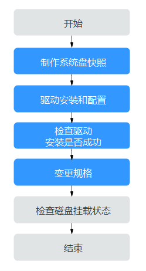

# XEN实例变更为KVM实例（Linux-手动配置）<a name="ZH-CN_TOPIC_0200552469"></a>

## 操作场景<a name="section9265624184119"></a>

Linux操作系统XEN实例变更为KVM实例前，必须完成驱动的安装和配置。

本节操作指导您手动安装Linux云服务器驱动、配置磁盘自动挂载等，并将XEN实例变更为KVM实例。

如需使用自动化脚本安装驱动的方法请参考[XEN实例变更为KVM实例（Linux-自动配置）](XEN实例变更为KVM实例（Linux-自动配置）.md)。

> **说明：**   
>-   XEN实例：S1、C1、C2、M1型弹性云服务器。  
>-   KVM实例：参考[规格清单](https://support.huaweicloud.com/productdesc-ecs/zh-cn_topic_0159822360.html)，查询对应规格的虚拟化类型。  
>-   为了同时支持XEN虚拟化和KVM虚拟化，Linux弹性云服务器的正常运行需依赖于xen-pv驱动、virtio驱动等。XEN实例变更为KVM实例前，需要确保Linux弹性云服务器已完成相关配置，包括安装驱动、配置磁盘自动挂载等。  

## 约束与限制<a name="section32289014501"></a>

-   Linux操作系统云服务器如果存在由多个物理卷组成的LVM逻辑卷或组建了RAID磁盘阵列，均不支持变更规格，否则可能会导致数据丢失。
-   对于XEN实例，当挂载的VBD磁盘超过24块时，不支持将规格变更为KVM实例。
-   系统支持将“XEN实例”变更为“KVM实例”，不支持将“KVM实例”变更为“XEN实例”。

## 操作流程<a name="section117911026122211"></a>

XEN实例变更为KVM实例的操作流程如[图1](#fig11687951132115)所示。

**图 1**  Linux云服务器变更流程（手动配置）<a name="fig11687951132115"></a>  


**表 1**  XEN实例变更为KVM实例（手动配置）

<a name="table1286142613223"></a>
<table><thead align="left"><tr id="row38601426132214"><th class="cellrowborder" valign="top" width="35.4%" id="mcps1.2.3.1.1"><p id="p10860142632210"><a name="p10860142632210"></a><a name="p10860142632210"></a>序号</p>
</th>
<th class="cellrowborder" valign="top" width="64.60000000000001%" id="mcps1.2.3.1.2"><p id="p4860226192217"><a name="p4860226192217"></a><a name="p4860226192217"></a>任务</p>
</th>
</tr>
</thead>
<tbody><tr id="row12860162652214"><td class="cellrowborder" valign="top" width="35.4%" headers="mcps1.2.3.1.1 "><p id="p086062642211"><a name="p086062642211"></a><a name="p086062642211"></a>步骤1</p>
</td>
<td class="cellrowborder" valign="top" width="64.60000000000001%" headers="mcps1.2.3.1.2 "><p id="p13348104210020"><a name="p13348104210020"></a><a name="p13348104210020"></a><a href="#section15236154665218">步骤1：制作系统盘快照</a></p>
</td>
</tr>
<tr id="row28601626182218"><td class="cellrowborder" valign="top" width="35.4%" headers="mcps1.2.3.1.1 "><p id="p5860192632218"><a name="p5860192632218"></a><a name="p5860192632218"></a>步骤2</p>
</td>
<td class="cellrowborder" valign="top" width="64.60000000000001%" headers="mcps1.2.3.1.2 "><p id="p4860526112216"><a name="p4860526112216"></a><a name="p4860526112216"></a><a href="#section69551357194518">步骤2：安装驱动</a></p>
</td>
</tr>
<tr id="row138618263229"><td class="cellrowborder" valign="top" width="35.4%" headers="mcps1.2.3.1.1 "><p id="p386032662215"><a name="p386032662215"></a><a name="p386032662215"></a>步骤3</p>
</td>
<td class="cellrowborder" valign="top" width="64.60000000000001%" headers="mcps1.2.3.1.2 "><p id="p4860162642215"><a name="p4860162642215"></a><a name="p4860162642215"></a><a href="#section181471144418">步骤3：检查云服务器配置是否成功</a></p>
</td>
</tr>
<tr id="row38612269223"><td class="cellrowborder" valign="top" width="35.4%" headers="mcps1.2.3.1.1 "><p id="p1686111268228"><a name="p1686111268228"></a><a name="p1686111268228"></a>步骤4</p>
</td>
<td class="cellrowborder" valign="top" width="64.60000000000001%" headers="mcps1.2.3.1.2 "><p id="p9535155112717"><a name="p9535155112717"></a><a name="p9535155112717"></a><a href="#section1815152131917">步骤4：变更规格</a></p>
</td>
</tr>
<tr id="row11861126192210"><td class="cellrowborder" valign="top" width="35.4%" headers="mcps1.2.3.1.1 "><p id="p1086182642219"><a name="p1086182642219"></a><a name="p1086182642219"></a>步骤5</p>
</td>
<td class="cellrowborder" valign="top" width="64.60000000000001%" headers="mcps1.2.3.1.2 "><p id="p6861326162215"><a name="p6861326162215"></a><a name="p6861326162215"></a><a href="#section2625525131519">（可选）步骤5：检查磁盘挂载状态</a></p>
</td>
</tr>
</tbody>
</table>

## 步骤1：制作系统盘快照<a name="section15236154665218"></a>

变更规格前必须先配置弹性云服务器，安装相应驱动，否则规格变更后，弹性云服务器无法使用，可能会造成系统盘数据丢失。因此，建议您先制作系统盘快照，然后再配置弹性云服务器。

制作系统盘快照的操作，请参见《云硬盘用户指南》的“用户指南 \>  [创建快照](https://support.huaweicloud.com/usermanual-evs/zh-cn_topic_0066615262.html)”章节。

> **说明：**   
>变更规格完成后，如已确认业务恢复正常，请在快照页面手动删除快照。  

## 步骤2：安装驱动<a name="section69551357194518"></a>

对于不支持使用脚本方式配置的弹性云服务器，请参见本部分内容，手动配置云服务器。

1.  登录弹性云服务器。
2.  卸载云服务器中已安装的Tools。

    卸载操作请参见[在Linux系统中卸载Tools](https://support.huaweicloud.com/zh-cn/usermanual-ims/ims_01_0323.html)。

3.  修改grub的UUID。

    具体操作请参见[修改grub文件磁盘标识方式为UUID](https://support.huaweicloud.com/zh-cn/usermanual-ims/ims_01_0324.html)。

4.  修改fstab的UUID。

    具体操作请参见[修改fstab文件磁盘标识方式为UUID](https://support.huaweicloud.com/zh-cn/usermanual-ims/ims_01_0325.html)。

5.  安装原生的XEN和KVM驱动。

    安装方法请参见[安装原生的XEN和KVM驱动](https://support.huaweicloud.com/zh-cn/usermanual-ims/ims_01_0326.html)。


## 步骤3：检查云服务器配置是否成功<a name="section181471144418"></a>

根据[步骤2：安装驱动](#section69551357194518)修改grub文件、安装所需驱动后，需检查修改是否生效、驱动是否安装成功。

> **须知：**   
>手动方式配置弹性云服务器时请务必执行以下操作检查云服务器配置是否成功。  

1.  登录弹性云服务器。
2.  执行以下命令，检查root分区是否以UUID的形式表示。

    **cat /boot/grub/grub.cfg**

    -   是，表示已修改grub文件的磁盘标识方式为UUID。
    -   否，修改失败，请参见[步骤2：安装驱动](#section69551357194518)重新修改。

    ```
    ……menuentry 'Ubuntu Linux, with Linux 3.13.0-24-generic' --class ubuntu --class gnu-linux --class gnu --class os --unrestricted $menuentry_id_option 'gnulinux-3.13.0-24-generic-advanced-ec51d860-34bf-4374-ad46-a0c3e337fd34' {
    recordfail
    load_video
    gfxmode $linux_gfx_mode
    insmod gzio
    insmod part_msdos
    insmod ext2
    if [ x$feature_platform_search_hint = xy ]; then
    search --no-floppy --fs-uuid --set=root ec51d860-34bf-4374-ad46-a0c3e337fd34
    else
    search --no-floppy --fs-uuid --set=root ec51d860-34bf-4374-ad46-a0c3e337fd34
    fi
    echo ‘Loading Linux 3.13.0-24-generic ...’
    linux /boot/vmlinuz-3.13.0-24-generic root=UUID=ec51d860-34bf-4374-ad46-a0c3e337fd34 ro
    echo ‘Loading initial ramdisk ...’
    initrd /boot/initrd.img-3.13.0-24-generic
    }
    ```

    > **说明：**   
    >对于不同操作系统，grub文件的具体路径存在差异，请以具体的操作系统为准。例如：“/boot/grub/menu.lst”、“/boot/grub/grub.cfg”、“/boot/gurb2/grub.cfg、“/boot/grub/grub.conf”。  

3.  执行以下命令，检查磁盘的标识方式是否为UUID。

    **cat /etc/fstab**

    -   是，表示已修改fstab文件的磁盘标识方式为UUID。
    -   否，修改失败，请参见[步骤2：安装驱动](#section69551357194518)重新修改。

    ```
    [root@****** ~]# cat /etc/fstab 
    UUID=4eb40294-4c6f-4384-bbb6-b8795bbb1130  /       xfs     defaults    0 0
    UUID=2de37c6b-2648-43b4-a4f5-40162154e135  swap    swap    defaults    0 0
    ```

4.  检查是否已安装原生的XEN和KVM驱动。

    -   如果引导的虚拟文件系统是initramfs，执行以下命令：

        **lsinitrd /boot/initramfs-\`uname -r\`.img | grep xen**

        **lsinitrd /boot/initramfs-\`uname -r\`.img | grep virtio**

    -   如果引导的虚拟文件系统是initrd ，执行如下命令：

        **lsinitrd /boot/initrd-\`uname -r\` | grep xen**

        **lsinitrd /boot/initrd-\`uname -r\` | grep virtio**

    如果安装成功，回显将显示已安装的原生XEN和KVM驱动名称。

    ```
    [root@CTU10000xxxxx home]# lsinitrd /boot/initramfs-`uname -r`.img | grep xen 
    -rwxr--r--   1 root     root        54888 Jul 16 17:53 lib/modules/2.6.32-573.8.1.el6.x86_64/kernel/drivers/block/xen-blkfront.ko 
    -rwxr--r--   1 root     root        45664 Jul 16 17:53 lib/modules/2.6.32-573.8.1.el6.x86_64/kernel/drivers/net/xen-netfront.ko 
     
    [root@CTU10000xxxxx home]# lsinitrd /boot/initramfs-`uname -r`.img | grep virtio 
    -rwxr--r--   1 root     root        23448 Jul 16 17:53 lib/modules/2.6.32-573.8.1.el6.x86_64/kernel/drivers/block/virtio_blk.ko 
    -rwxr--r--   1 root     root        50704 Jul 16 17:53 lib/modules/2.6.32-573.8.1.el6.x86_64/kernel/drivers/net/virtio_net.ko 
    -rwxr--r--   1 root     root        28424 Jul 16 17:53 lib/modules/2.6.32-573.8.1.el6.x86_64/kernel/drivers/scsi/virtio_scsi.ko 
    drwxr-xr-x   2 root     root            0 Jul 16 17:53 lib/modules/2.6.32-573.8.1.el6.x86_64/kernel/drivers/virtio 
    -rwxr--r--   1 root     root        14544 Jul 16 17:53 lib/modules/2.6.32-573.8.1.el6.x86_64/kernel/drivers/virtio/virtio.ko 
    -rwxr--r--   1 root     root        21040 Jul 16 17:53 lib/modules/2.6.32-573.8.1.el6.x86_64/kernel/drivers/virtio/virtio_pci.ko 
    -rwxr--r--   1 root     root        18016 Jul 16 17:53 lib/modules/2.6.32-573.8.1.el6.x86_64/kernel/drivers/virtio/virtio_ring.ko
    ```


> **须知：**   
>请务必确保云服务器配置成功，否则，可能会导致变更规格后的弹性云服务器不可用。  

## 步骤4：变更规格<a name="section1815152131917"></a>

1.  登录控制台。
2.  单击管理控制台左上角的，选择区域和项目。
3.  选择“计算 \> 弹性云服务器”。
4.  在弹性云服务器列表，查询待变更弹性云服务器状态。

    如果不是关机状态，单击“操作”列下的“更多 \> 关机”。

5.  单击“操作”列下的“更多 \> 变更规格”。

    系统进入“云服务器变更规格”页面。

6.  根据界面提示，选择变更后的云服务器类型、vCPU和内存。
7.  （可选）选择“专属主机”。

    对于在专属主机上创建的弹性云服务器，系统支持更换云服务器所在的专属主机。

    此时，您可以单击下拉列表，选择更换专属主机。如果下拉列表中无可用的专属主机，说明专属主机所剩资源不足，不能用于创建变更规格后的弹性云服务器。

8.  勾选复选框“我确认已完成对弹性云服务器的配置”，确认已完成“配置弹性云服务器”操作。
9.  单击“确定”。

    > **说明：**   
    >-   单击“确定”后云平台自动为您制作系统盘快照。变更规格完成后，如已确认业务恢复正常，请在快照页面手动删除快照。  
    >-   如果变更规格失败后，弹性云服务器无法使用，可能会需要重装操作系统来恢复云服务器，请注意重装操作系统会清除系统盘数据，但不影响数据盘的数据。  


## （可选）步骤5：检查磁盘挂载状态<a name="section2625525131519"></a>

XEN实例变更为KVM实例时，可能会发生磁盘挂载失败的情况，因此，变更规格后，需检查磁盘挂载状态是否正常。如果正常，则变更成功。

详细操作请参考[Linux云服务器变更规格后数据盘脱机怎么办？](https://support.huaweicloud.com/ecs_faq/ecs_faq_0619.html)

## 后续处理<a name="section7460163511720"></a>

如果控制台上云服务器列表页，显示弹性云服务器已变更规格成功，但是远程登录云服务器后，操作系统无法启动，此时，请联系技术支持进行恢复，或重装操作系统进行恢复。重装系统的操作指导，请参见[重装操作系统](重装操作系统.md)。

> **说明：**   
>重装操作系统会清除系统盘数据，但不影响数据盘的数据。  

变更规格完成后，如已确认业务恢复正常，请在快照页面手动删除快照。

