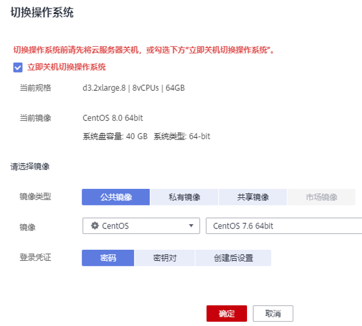

# 切换操作系统

## 操作场景

切换操作系统是为您的弹性云服务器重新切换一个系统盘。切换完成后弹性云服务器的系统盘ID会发生改变，并删除原有系统盘。

如果弹性云服务器当前使用的操作系统不能满足业务需求（如软件要求的操作系统版本较高），您可以选择切换弹性云服务器的操作系统。

公有云平台支持不同镜像类型（包括公共镜像、私有镜像、共享镜像以及市场镜像）与不同操作系统之间的互相切换。您可以将现有的操作系统切换为不同镜像类型的操作系统。

## 约束与限制

-   “包年/包月”方式购买的弹性云服务器切换操作系统时，由于所选镜像不同，当前云服务器的系统盘容量可能不足，不支持切换后的镜像使用。此时，需先卸载系统盘并进行扩容，然后再重新切换操作系统。
-   “包年/包月”方式购买的弹性云服务器切换操作系统时，由于费用原因，不支持使用市场镜像。
-   对于“包年/包月”方式购买的弹性云服务器，仅支持由免费的操作系统切换至免费的操作系统。
-   使用市场镜像创建的“包年/包月”弹性云服务器不支持切换操作系统。
-   云硬盘的配额需大于0。
-   H2型弹性云服务器不支持操作系统的切换功能。
-   不支持BIOS启动方式与UEFI启动方式的操作系统互相切换。

## 切换须知

-   切换操作系统后，弹性云服务器将不再保留原操作系统，并删除原有系统盘。
-   切换操作系统会清除系统盘数据，包括系统盘上的系统分区和所有其它分区，请做好数据备份。
-   切换操作系统后，您的业务运行环境需要在新的系统中重新部署。
-   切换操作系统成功后弹性云服务器会自动开机。
-   切换操作系统后不支持更换系统盘的云硬盘类型。
-   切换操作系统后弹性云服务器IP地址和MAC地址不发生改变。
-   切换操作系统后，当前操作系统内的个性化设置（如DNS、主机名等）将被重置，需重新配置。
    -   重新配置云服务器DNS信息请参考：[怎样配置弹性云服务器的DNS和NTP信息？](https://support.huaweicloud.com/ecs_faq/zh-cn_topic_0074825901.html)
    -   重新配置主机名请参考：[怎样使修改的静态主机名永久生效？](https://support.huaweicloud.com/ecs_faq/zh-cn_topic_0050735736.html)

-   切换操作预计需等待10\~20分钟完成切换操作系统。切换操作系统过程中，弹性弹性云服务器会显示任务状态为“切换操作系统中”。

## 计费规则

-   切换操作系统功能不收费。按需计费的云服务器切换成功后，系统将按照新的配置费用（系统盘、规格）进行计费。
-   “按需付费”方式购买的弹性云服务器切换操作系统后，由于所选镜像不同，系统盘的容量可能会增大，由此将带来费用的变更，具体收费请参见[产品价格详情](https://support.huaweicloud.com/pro_price/index.html)。

## 跨操作系统切换须知

跨操作系统切换是指Windows与Linux操作系统之间的互相切换。

-   Windows系统更换为Linux系统：请安装读写Windows系统的NTFS分区工具，例如NTFS-3G等。
-   Linux系统更换为Windows系统：请安装可以识别ext3、ext4等分区的识别软件，例如Ext2Read、Ext2Fsd等。

    > **说明：**   
    >云平台不推荐您将Linux系统更换为Windows系统，当Linux系统中存在LVM分区时，切换为Windows系统后可能会导致LVM逻辑分区无法识别。  

## 前提条件

-   待切换操作系统的弹性云服务器处于“关机”状态、“切换失败”或“重装失败”状态。
-   待切换操作系统的弹性云服务器挂载有系统盘。
-   切换操作系统会清除系统盘数据，包括系统盘上的系统分区和所有其它分区，请做好数据备份。
-   如果原服务器使用的是密码登录方式，切换操作系统后使用密钥登录方式，请提前创建密钥文件。
-   如果您使用私有镜像切换操作系统请参考[《镜像服务用户指南》](https://support.huaweicloud.com/usermanual-ims/zh-cn_topic_0013901628.html)提前完成私有镜像的制作。
    -   如果需要指定弹性云服务器器的镜像，请提前使用指定弹性云服务器创建私有镜像。
    -   如果需要使用本地的镜像文件，请提前将镜像文件导入并注册为云平台的私有镜像。
    -   如果需要使用其他区域的私有镜像，请提前复制镜像。
    -   如果需要使用其他账号的私有镜像，请提前完成镜像共享。

## 操作步骤

1.  登录管理控制台。
2.  单击管理控制台左上角的，选择区域和项目。
3.  选择“计算 \> 弹性云服务器”。
4.  选择待切换操作系统的弹性云服务器，单击弹性云服务器列表左上角的“关机”。
5.  在待切换操作系统的弹性云服务器的“操作”列下，单击“更多 \> 切换操作系统”。

    系统进入“切换操作系统”界面。

6.  根据需求选择需要更换的弹性云服务器规格，包括“镜像类型”和“镜像”。

    > **说明：**   
    >对于“包年/包月”方式购买的弹性云服务器，如果系统盘容量小于您选择的待切换镜像的大小，此时，您需要先卸载系统盘，并进行扩容，然后再挂载至原弹性云服务器执行切换操作。  
    >扩容系统盘的操作指导，请参见[“扩容云硬盘”](https://support.huaweicloud.com/usermanual-evs/evs_01_0006.html)章节。  

    **图 1**  切换操作系统  
    

7.  设置登录方式。

    如果待切换操作系统的弹性云服务器是使用密钥登录方式创建的，此时可以更换使用新密钥。

8.  单击“确定”。
9.  在“切换云服务器操作系统”页面，确认切换的操作系统规格无误后，阅读并勾选“我已经阅读并同意《华为弹性云服务器服务协议》”，单击“提交申请”。

    提交切换操作系统的申请后，弹性云服务器的状态变为“切换中”，当该状态消失后，表示切换结束。

    > **说明：**   
    >切换操作系统过程中，会创建一台临时弹性云服务器，切换操作系统结束后会自动删除。  

## 后续处理

如果操作系统切换失败，公有云平台支持重试功能，用户可重新执行[3](#zh-cn_topic_0031523135_zh-cn_topic_0024911405_li45082966143628)-[9](#zh-cn_topic_0031523135_zh-cn_topic_0024911405_li45992498111556)，切换弹性云服务器的操作系统。

重试后，如果仍未成功，可直接联系客服，客服会在后台进行人工恢复。

