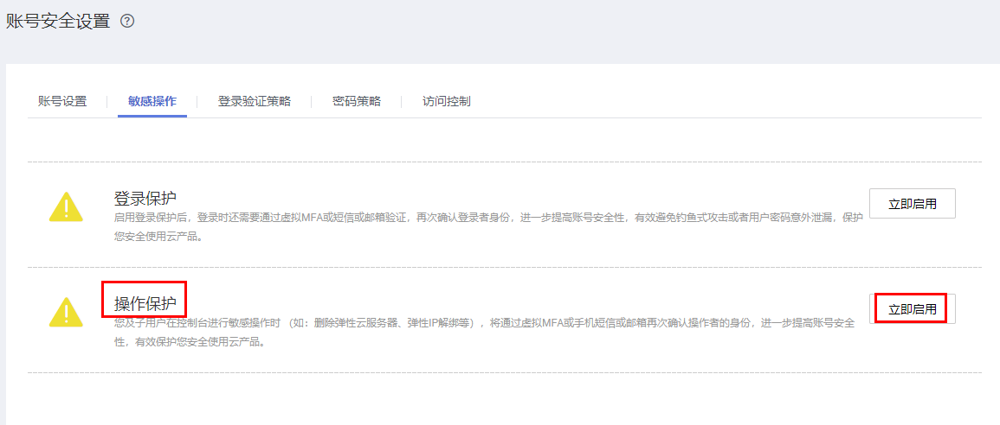
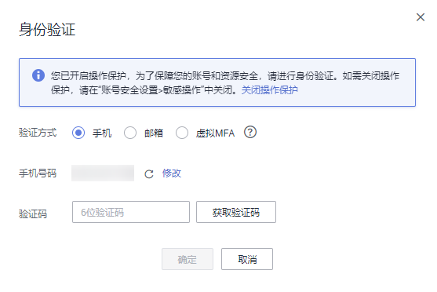
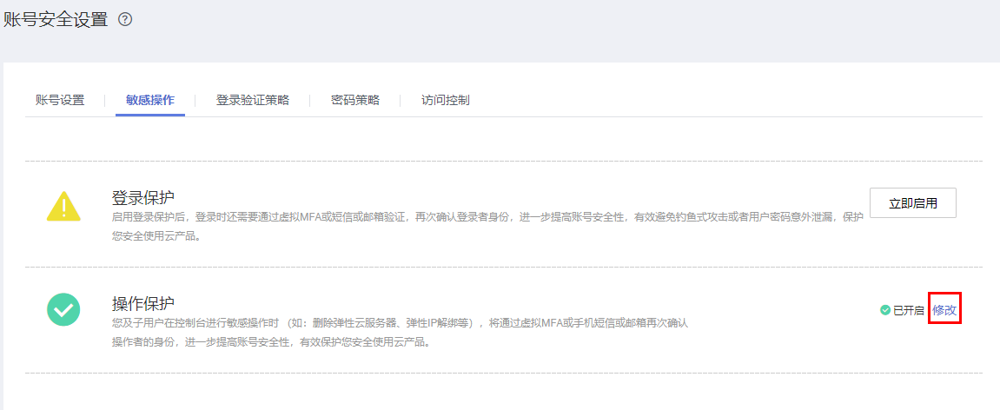

# 敏感操作保护

## 操作场景

弹性云服务器支持敏感操作保护，在控制台进行敏感操作时，需要输入一种能证明身份的凭证，身份验证通过后方可进行相关操作。为了账号安全，建议开启操作保护功能，该功能对账号以及账号下的用户都生效。

目前支持：关机、重启、删除、重置密码、卸载磁盘、解绑弹性公网IP。

## 开启操作保护

操作保护默认关闭，您可以参考以下步骤开启操作保护。

1.  登录华为云控制台。
2.  在“控制台”页面，鼠标移动至右上方的用户名，在下拉列表中选择“安全设置”。

    **图 1**  安全设置  
    

3.  在“账号安全设置”页面中，选择“敏感操作 \> 操作保护 \> 立即启用”。

    **图 2**  敏感操作  
    

4.  在“操作保护设置”页面中，选择“开启”，单击“确定”后，开启操作保护。

    开启后，您以及账号中的IAM用户进行敏感操作时，例如删除弹性云服务器资源，需要输入验证码进行验证，避免误操作带来的风险和损失。

    > **说明：** 
    >-   用户如果进行敏感操作，将进入“操作保护”页面，选择认证方式，包括邮箱、手机和虚拟MFA三种认证方式。
    >    -   如果用户只绑定了手机，则认证方式只能选择手机。
    >    -   如果用户只绑定了邮箱，则认证方式只能选择邮件。
    >    -   如果用户未绑定邮箱、手机和虚拟MFA，进行敏感操作时，华为云将提示用户绑定邮箱、手机或虚拟MFA。
    >-   如需修改验证手机、邮箱、虚拟MFA设备，请在[账号设置](https://support.huaweicloud.com/usermanual-iam/iam_01_0703.html#iam_01_0703)中修改。

## 操作保护验证

当您已经开启操作保护，在进行敏感操作时，系统会先进行操作保护验证：

-   若您绑定了邮箱，需输入邮箱验证码。
-   若您绑定了手机，需输入手机验证码。
-   若您绑定了虚拟MFA，需输入MFA设备上的6位动态验证码。

如[图3](#zh-cn_topic_0173524330_fig10571518135913)所示，尝试关机弹性云服务器时，弹出以下验证框，选择一种验证方式：

**图 3**  操作保护身份验证  

## 关闭操作保护

如需关闭操作保护，请参考以下步骤操作。

1.  登录华为云控制台。
2.  在“控制台”页面，鼠标移动至右上方的用户名，在下拉列表中选择“安全设置”。

    **图 4**  安全设置  
    

3.  在“账号安全设置”页面中，选择“敏感操作 \> 操作保护 \> 修改”。

    **图 5**  修改敏感操作  
    

4.  在“操作保护设置”页面中，选择“关闭”，单击“确定”后，关闭操作保护。

## 相关链接

-   [如何绑定虚拟MFA设备？](https://support.huaweicloud.com/iam_faq/iam_01_0003.html)
-   [如何获取MFA验证码？](https://support.huaweicloud.com/iam_faq/iam_01_0001.html)

