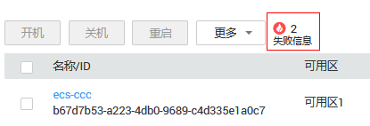

# 查看失败任务

## 操作场景

“失败信息”栏记录了系统处理中发生异常，导致处理失败的任务，包括该任务的“名称”、“状态”等信息。当有处理失败的操作时，控制台将显示该内容。本节介绍如何查看“失败信息”。

## 失败信息事件类型

“失败信息”栏记录的失败信息事件类型如[表1](#table155141127195016)所示。

**表 1**  失败信息事件类型

<table><thead align="left"><tr id="row175151927105012"><th class="cellrowborder" valign="top" width="21.89%" id="mcps1.2.3.1.1">
事件类型

</th>
<th class="cellrowborder" valign="top" width="78.11%" id="mcps1.2.3.1.2">
说明

</th>
</tr>
</thead>
<tbody><tr id="row8515127155014"><td class="cellrowborder" valign="top" width="21.89%" headers="mcps1.2.3.1.1 ">
创建失败

</td>
<td class="cellrowborder" valign="top" width="78.11%" headers="mcps1.2.3.1.2 ">
指未能成功处理的请求。对于创建失败的任务，系统会自动回退，同时在界面上直观的展示错误码，例如“（Ecs.0013）EIP配额不足”。

</td>
</tr>
<tr id="row1151562711507"><td class="cellrowborder" valign="top" width="21.89%" headers="mcps1.2.3.1.1 ">
操作失败

</td>
<td class="cellrowborder" valign="top" width="78.11%" headers="mcps1.2.3.1.2 "><ul id="ul296746155113"><li>变更规格
用户申请变更规格后，如果规格变更失败，则“失败信息”栏将显示本次变更规格操作。

</li></ul>
</td>
</tr>
</tbody>
</table>

## 操作步骤

1.  登录管理控制台。
2.  单击管理控制台左上角的，选择区域和项目。
3.  选择“计算 \> 弹性云服务器”。
4.  常用操作“开机/关机/重启/更多”的右侧即为“失败信息”。

    **图 1**  失败任务  
    

5.  单击“失败信息”栏对应的数字，即可查看系统处理失败的任务详情。其中：
    -   创建失败：您可以从创建失败的列表中查看创建中和创建失败的任务。
    -   操作失败：您可以从操作失败列表中查看处理异常的任务，包括异常任务的具体操作、错误码等，便于定位系统处理异常的原因，及时予以恢复。

